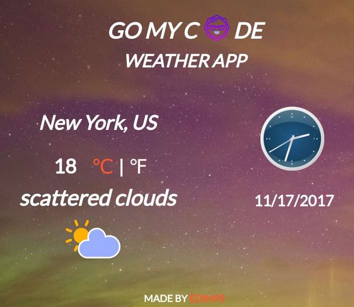

# Weather App 

## This project is part of the [gomycode](https://gomycode.tn) fullstack JS cursus.

## User Stories

1. <strong>User Story:</strong> I can see the weather in my current location.

2. <strong>User Story:</strong> I can see a different icon or background image (e.g. snow mountain, hot desert) depending on the weather.

3. <strong>User story:</strong> I can push a button to toggle between Fahrenheit and Celsius.

4. <strong>User Story:</strong> I can see a loading spinner while the application is loading the weather data.

    

# What did I learn:

1. How to use the freeCodeCamp weather API.

2. The basics of XHR (XMLHTTPRequest), AJAX, JSON.

3. Manipulate the DOM from an API's outcome.

4. The very basics of the OOP..